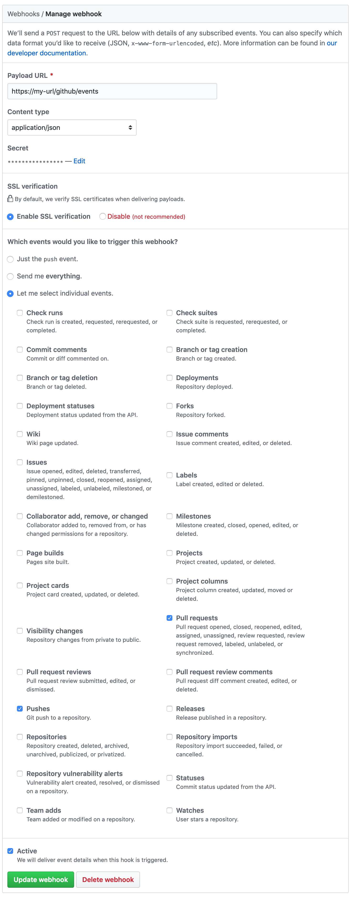

[](https://gitlab.com/brndnmtthws-oss/labhub/commits/master) [](https://travis-ci.org/brndnmtthws/labhub) [](https://coveralls.io/github/brndnmtthws/labhub) [](https://crates.io/crates/labhub)

# 🤖 LabHub

A GitHub bot written in Rust for using GitLab CI in OSS projects.

## Features

- Listens for webhooks from GitHub
- Pushes new branches to GitLab for external (forked) PRs
- Possibly more coming soon 👻

## The Problem

GitLab has a great CI system, however it's not suitable for open source projects 😧 (at the time of writing) because it won't build external PRs by default. There are security concerns about the risk of exposing secrets in external builds, and GitLab errs on the side of caution by not building external PRs by default.

For more details on the issue, [please take a look at this GitLab discussion](https://gitlab.com/gitlab-org/gitlab-ee/issues/5667).

## The Solution

If you're not concerned with leaking secrets, then LabHub may be for you! LabHub listens for webhooks from GitHub to notify for new pull requests. If the PR is from a forked repo, it will push a branch to GitLab (for the corresponding PR) to test the build.

## In Action

LabHub is currently being used by the [Conky](https://github.com/brndnmtthws/conky) project.

Using LabHub? Please open a PR to add yourself here! 😀

## Configuration

LabHub is configured using [`LabHub.toml`](LabHub.toml). For details, see [src/config.rs](src/config.rs). You can specify the path to `LabHub.toml` by setting the `LABHUB_TOML` environment variable.

## Deployment

### Setup Webhooks

You'll need to set up webhooks for any repo you wish to enable LabHub for. Currently, only GitHub webhooks are required. To get started, go to `github.com/<org>/<repo>/settings/hooks` and add a new webhook.

Configure the webhook to send PR and push events.

- Set the payload URL such that it ends in `/github/events`, which is the path LabHub is expecting.
- Create a secrete (ex: `cat /dev/urandom | LC_CTYPE=C tr -dc 'a-zA-Z0-9' | fold -w 32 | head -n 1`) and set the same value in the webhook config as in LabHub.
- Make sure the payload type is `application/json`.

Example:

<a href="docs/github-webhook-config.png"></a>

### 🔑 Create SSH keys

You'll need a CI user with SSH keys for both GitHub and GitLab. Create an account on both sites (if you don't already have a CI user), and create an SSH key for LabHub:

```ShellSession
$ ssh-keygen -f labhub-key.ecdsa -t ecdsa -b 521
```

Keep `labhub-key.ecdsa` safe, and upload `labhub-key.ecdsa.pub` to both GitHub and GitLab for the CI user.

### ☸️ Deploy to Kubernetes with Helm

There's a Helm chart included in this repo, which is the preferred method of deployment. To use you, you must first create the SSH key secrets with kubectl. Assuming your SSH private key is `labhub-key.ecdsa`:

```ShellSession
$ kubectl create secret generic ssh-keys --from-file=github=labhub-key.ecdsa --from-file=gitlab=labhub-key.ecdsa
```

You may use separate keys for GitHub and GitLab if you choose, respectively.

Once you have the secrets, install the helm chart from [helm/labhub/](helm/labhub/):

```ShellSession
$ cd helm/labhub/
$ cp values.yaml myvalues.yaml
# Edit myvalues.yaml to your liking
$ helm upgrade --install labhub . -f myvalues.yaml
```
